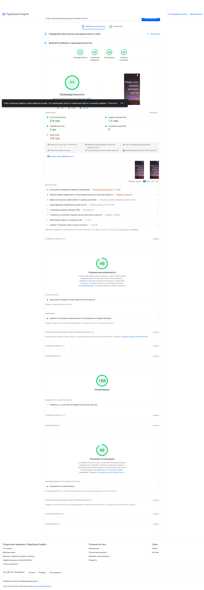

## Задание 11 (контрольное)
##### _Подготовил студент группы 6012, Козловский А.А._

### Подготовка `AMP` страницы

Для того чтобы оптимизировать загрузку страницы (особенно для мобильных устройств) используется технология AMP.

Для того чтобы создать оптимизированную страницу AMP, необходимо в `head` секции указать: 

```html
<script async src="https://cdn.ampproject.org/v0.js"></script>
<style amp-boilerplate>body{-webkit-animation:-amp-start 8s steps(1,end) 0s 1 normal both;-moz-animation:-amp-start 8s steps(1,end) 0s 1 normal both;-ms-animation:-amp-start 8s steps(1,end) 0s 1 normal both;animation:-amp-start 8s steps(1,end) 0s 1 normal both}@-webkit-keyframes -amp-start{from{visibility:hidden}to{visibility:visible}}@-moz-keyframes -amp-start{from{visibility:hidden}to{visibility:visible}}@-ms-keyframes -amp-start{from{visibility:hidden}to{visibility:visible}}@-o-keyframes -amp-start{from{visibility:hidden}to{visibility:visible}}@keyframes -amp-start{from{visibility:hidden}to{visibility:visible}}</style><noscript><style amp-boilerplate>body{-webkit-animation:none;-moz-animation:none;-ms-animation:none;animation:none}</style></noscript>
```

Сама по себе технология `AMP` строится на том, что разработчик заменяет некоторые элементы страницы на оптимизированные.
Например, в нашем случае, мы можем заменить все изображения на `amp-img`

Было:

```html
<div class="img"></div>
```

```css
.img {
    backgound-image: url("some/url.jpg");
}
```

Стало:

```html
 <amp-img
        src="some/url.jpg"
        width="629"
        height="350"
        layout="fixed"
></amp-img>
```


Таким образом, заменим все избражения с использованием `amp-img`.

Также, нам необходимо максимально сократить количество файлов с кодом, которыми мы обмениваемся. Поэтому, мы вносим
описание наших стилей в `html` файл, обрамляя их в тэг `style` с параметром `amp-custom`. Это необходимо сделать
в разделе `head`.


Нам также необходимо указать метаинформацию со ссылкой на полную версию сайта в `head` секции.

```html
    <link rel="canonical" href="https://alexeykozlovsky.github.io/fullstack-task-4/" />
```

После того, как мы сформировали `AMP` страницу, мы можем проверить валидность `AMP` верстки с помощью различных 
онлайн-инструментов. Для примера, будем использовать: https://validator.ampproject.org/#.

Как можно заметить из следующего рисунка, наша страница является валидной `AMP` страницей


### Хостинг

Захостим нашу страницу с помощью `Github Pages`.

В результате мы увидим такую страницу:


Как мы видим, картинки немного съехали, но `AMP` оптимизация, влияет на отображение, что делает сайт менее привлекательным.

Исходная верстка была вот такой:


### Измерение производительности

Измерим теперь производительность по полной версии страницы и по `AMP` версии страницы с помощью сервиса
https://pagespeed.web.dev/?utm_source=psi&utm_medium=redirect&hl=ru

#### Результаты измерений для полной версии

Для мобильной версии мы имеем следующие показатели



Для PC версии мы имеем следующие показатели


#### Результаты измерений для `AMP` версии

Для мобильной версии мы имеем следующие показатели


Для PC версии мы имеем следующие показатели


#### Сравнительная таблица показателей измерений для полной и `AMP` версий

Сравнительная таблицы для мобильных устройств

|                          | Полная версия | `AMP` версия |
|--------------------------|---------------|--------------|
| First Contentful Paint   | 0.8 сек       | 1.5 сек      |
| Total Blocking Time      | 0 мс          | 0 мс         |
| Speed Index              | 3.6 сек       | 1.5 сек      |
| Largest Contentful Paint | 1.4 сек       | 2.0 сек      |
| Cumulative Layout Shift  | 0             | 0            |


Сравнительная таблицы для PC устройств

|                          | Полная версия | `AMP` версия |
|--------------------------|---------------|--------------|
| First Contentful Paint   | 0.2 сек       | 0.4 сек      |
| Total Blocking Time      | 0 мс          | 0 мс         |
| Speed Index              | 0.3 сек       | 0.4 сек      |
| Largest Contentful Paint | 0.2 сек       | 0.5 сек      |
| Cumulative Layout Shift  | 0             | 0            |


### Выводы

Часто `AMP` позволяет оптимизировать работу тех сайтов, чьи страницы загружаются с недостаточным уровнем производительности
на мобильных устройствах. Однако в нашем случае, производительность для мобильных устройств у полной версии сайта
составляла 99, что говорит о том, что нет необходимости использовать `AMP` и заниматься оптимизацией в целом (т.к. любая
оптимизация усложняет читаемость кода).

В целом, иногда оптимизация может и наоборот понижать производительность в некоторых аспектах. В нашем случае произошло
нечто похожее. Однако показатель `Speed Index` (особенно для мобильных устройств) существенно улучшился благодаря внедрению
`AMP`.
